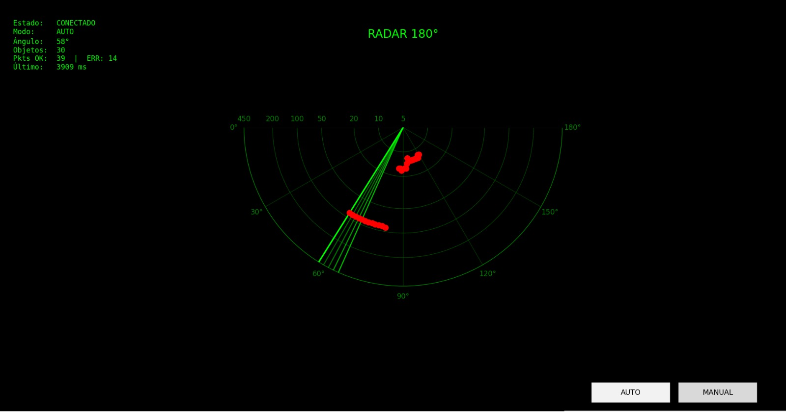
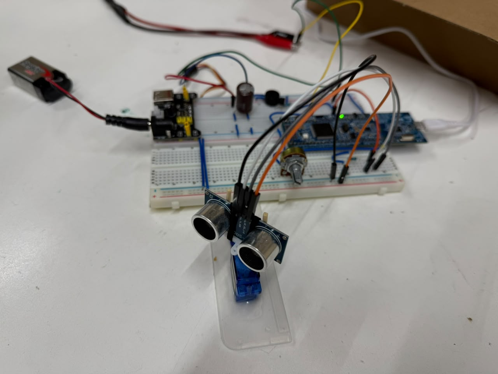

# Radar Ultrasónico 180° con Control Dual

> **Asignatura:** Electrónica Digital III - Universidad Nacional de Córdoba
> **Integrantes:**
>
> - Garay, Alexis Tomas
> - Guzman Gonzales, Pedro
> - Zucchella Paz, Valentino
>
> **Profesor:** Blasco, Marcos Javier

---

## 1. Descripción General

El sistema implementa un radar ultrasónico de barrido 180° sobre un microcontrolador LPC1769 (ARM Cortex-M3). Un sensor HC-SR04 montado sobre un servomotor SG90 realiza mediciones de distancia mientras barre el espacio frente a él. Los datos capturados se transmiten por UART a una PC, donde un script Python los grafica en tiempo real en formato polar, recreando visualmente la imagen de un radar.

El sistema resuelve la necesidad de visualizar la distribución espacial de objetos en un entorno de forma no invasiva y a bajo costo. Está orientado a aplicaciones educativas y de prototipado, sirviendo como base para sistemas de detección de presencia o asistencia a la navegación en robótica.

---

<p align="center">
  
</p>

<p align="center">
  
</p>

<p align="center">
  <a href="#evidencia-fotográfica-y-gráficos">Ver mas imagenes</a>
</p>
   
---
### Alcances
 
**Incluye:** barrido automático continuo 0°↔180°, control manual por potenciómetro, medición de distancia con HC-SR04 (2–450 cm, ±3 cm), transmisión de paquetes de 90 muestras `{ángulo, distancia}` por UART con DMA, detección de paquetes desincronizados en el receptor Python, y retroalimentación acústica (buzzer) y visual (LEDs).
 
**No incluye:** almacenamiento local de datos, conectividad inalámbrica, detección de múltiples objetos, compensación por temperatura, filtrado de la señal de distancia, ni uso de RTOS.
 
### Líneas futuras
 
- Migrar a PCB para mejorar integridad de señal.
- Conectividad inalámbrica (ESP8266/ESP32) para visualización remota.
- Segundo sensor para barrido en 3D.
- Modo de bajo consumo (sleep) para alimentación a batería.
- Reemplazar la interfaz Python por una pantalla TFT embebida.

---

## 2. Arquitectura del Sistema

### Hardware

- **Diagrama de Bloques:**
  

- **Esquemático del Circuito:**
  

- **Consideraciones:**

  La LPC1769 opera a 3.3V vía USB; el HC-SR04 y el SG90 se alimentan a 5V desde una fuente externa. Como el ECHO del sensor entrega 5V, se usa un divisor resistivo para bajarlo a 3.3V antes de ingresar a la placa.

  Se agregó un capacitor electrolítico de **1000 µF** entre VCC y GND del servo: el SG90 demanda picos de corriente al moverse bruscamente, y sin el capacitor esas caídas de tensión afectaban al resto del circuito.

  El DAC (P0.26) se conecta a un osciloscopio para visualizar la distancia medida como señal analógica, usado durante la depuración.

**Pinout:**

| Pin LPC | Función                   | Periférico    |
| ------- | ------------------------- | ------------- |
| P0.0    | Servo PWM (TIMER0)        | SG90          |
| P0.1    | Buzzer (DAC)              | Buzzer pasivo |
| P0.2    | UART TX                   | USB-Serial PC |
| P0.3    | UART RX                   | USB-Serial PC |
| P0.4    | ECHO capture (TIMER2 CAP) | HC-SR04       |
| P0.18   | TRIG (TIMER1)             | HC-SR04       |
| P0.22   | LED proximidad (<20cm)    | LED rojo      |
| P0.23   | Potenciómetro (ADC CH0)   | 10kΩ pot      |
| P0.26   | DAC (osciloscopio)        | Osciloscopio  |
| P3.25   | LED modo manual           | LED amarillo  |

### Firmware

La arquitectura es **bare-metal con lazo principal cooperativo e interrupciones**. No se utiliza RTOS; la concurrencia se logra enteramente mediante el NVIC del Cortex-M3 con 5 fuentes de interrupción independientes.

**Lazo principal (cada ~60 ms):**

```
1. Lee distancia medida por TIMER2 (aquí pasa la mayoria de tiempo)
2. Lee ángulo actual del servo
3. Actualiza DAC (buzzer + osciloscopio)
4. Modo AUTO: incrementa ángulo 2°  |  Modo MANUAL: lee ADC → calcula ángulo
5. Guarda muestra {ángulo, distancia} en buffer activo
6. Si buffer lleno (25 muestras) → dispara DMA TX por UART
```

- **Esquemático de Flujo:**
  

**Interrupciones:**

| Interrupción | Período    | Función                                           |
| ------------ | ---------- | ------------------------------------------------- |
| TIMER1_IRQ   | 60 ms      | Genera pulso TRIG de 10 µs para HC-SR04           |
| TIMER2_IRQ   | Por flanco | Captura tiempo de ECHO → calcula distancia (÷58)  |
| TIMER0_IRQ   | 20 ms      | Genera PWM del servo (500–2500 µs según ángulo)   |
| UART0_IRQ    | Por byte   | Recibe comandos: `'A'`→AUTO, `'M'`→MANUAL         |
| DMA_IRQ      | Por TX     | Libera flag `dma_busy` al completar transferencia |

**Double Buffering UART:** Mientras el Buffer A (360 bytes) se transmite por DMA, el Buffer B se llena. Garantiza que no se pierdan muestras durante la transmisión (~7 ms a 115200 baud)..

**Protocolo de trama UART:**

```
[0xAA][0x55][ángulo_L][ángulo_H][dist_L][dist_H] × 90 muestras
Header de sincronización 2 bytes + 90 structs de 4 bytes = 362 bytes/paquete
```

**Script Python (interfaz gráfica):**
El script Python valida el tamaño del paquete recibido contra los 362 bytes esperados; si no coincide, lo descarta y no lo grafica. También envía los comandos 'A'/'M' para cambiar el modo de operación.

---

## 3. Especificaciones Eléctricas, Alimentación y Entorno

|                          |                                                                               |
| ------------------------ | ----------------------------------------------------------------------------- |
| Tensión LPC1769 / lógica | 3.3V (USB)                                                                    |
| Tensión periféricos      | 5V (fuente externa)                                                           |
| Alimentación LPC         | USB desde PC                                                                  |
| Alimentación periféricos | Fuente externa 5V + capacitor de desacople 1000 µF en el servo                |
| IDE / SDK                | MCUXpresso IDE                                                                |
| Microcontrolador         | NXP LPC1769 (ARM Cortex-M3, 100 MHz)                                          |
| Bibliotecas              | Drivers del profesor David Trujillo (abstracción sobre CMSIS) + código propio |
| Periféricos usados       | NVIC, DMA, DAC 10-bit, ADC 12-bit (200 kHz), 3 Timers, UART0 (115200 baud)    |

---

## 4. Proceso de Integración y Desarrollo

1. **Validación de módulos:** se desarrollaron y probaron por separado el driver del servo (PWM/TIMER0) y del HC-SR04 (TIMER1/TIMER2), verificando rango angular y precisión de distancia.

2. **Integración del firmware:** se unió control de servo y lectura de sensor en el lazo principal, sumando ADC (modo manual) y DAC (retroalimentación).

3. **UART simple:** transmisión sin DMA por consola serie. Detectó un problema de **desincronización de datos**, resuelto agregando el header `0xAA 0x55` y validando longitud de paquete en el receptor.

4. **Sistema completo:** UART por DMA con double buffering, interfaz Python con gráfico polar, validación y descarte de paquetes erróneos, y pruebas de estrés en barridos prolongados.

---

## 5. Ensayos, Pruebas y Resultados

### Pruebas Funcionales Realizadas

- **Precisión HC-SR04:** medido contra distancias conocidas (10, 30, 50, 100 cm), error dentro de ±3 cm.

- **Resolución angular del servo:** verificado en 0°, 45°, 90°, 135°, 180°, error inferior a ±5°.

- **Protocolo UART:** se usó un script de debug por consola para ver los paquetes crudos y detectar la desincronización; tras el fix, la tasa de error cayó a 0 en condiciones normales.

- **Capacitor de desacople:** comparación en osciloscopio de la línea de 5V del servo con y sin el capacitor, confirmando la reducción de los picos de caída de tensión.

- **Modo manual:** verificado que el ángulo sigue linealmente el valor del potenciometro conectado al ADC (0–4095 → 0°–180°).

### Evidencia Fotográfica y Gráficos

- **Captura de osciloscopio – señal DAC distancia / línea 5V servo:**
<p align="center">
  
</p>

- **Screenshot interfaz Python – radar en funcionamiento:**
<p align="center">
  
</p>

- **Foto del prototipo real:**
<p align="center">
  
</p>

---

## 6. Estructura del Repositorio

```text
├── TP_FINAL_EDIII/
│   └── src/
│       ├── Config/              # Archivos .c y .h de los módulos del proyecto
│       └── TP_FINAL_EDIII.c     # Programa principal (main)
├── docs/
│   ├── diagrama.png             # Diagrama circuital
│   └── datasheets/              # HC-SR04, SG90, LPC1769
├── uart_monitor/
│   ├── radar_debug.py           # Debug de UART por consola
│   └── radar_app.py             # Interfaz gráfica polar + control de modo
└── README.md
```
