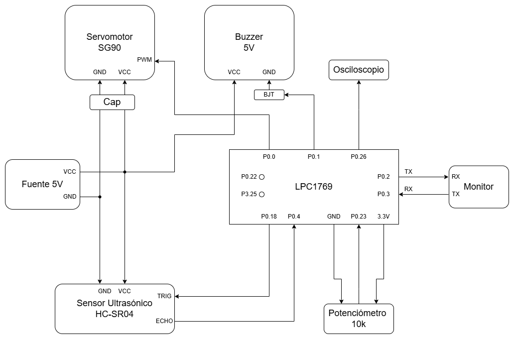

# 🎯 RADAR ULTRASÓNICO 180° CON CONTROL DUAL

## 📝 Descripción

Sistema embebido que captura datos de un **sensor ultrasónico HC-SR04** montado en un **servomotor** para realizar barridos de 180°. Ofrece control **automático** (desde PC) o **manual** (potenciometro), captura datos en tiempo real y transmite por UART a una interfaz gráfica. Incluye retroalimentación acústica (buzzer) y visual (LEDs).

---

## 🔧 Hardware

### Entradas
- **HC-SR04**: Sensor ultrasónico (rango 2-450cm, precisión ±3cm)
- **Potenciometro**: Control manual (ADC 0-4095 cuentas)

### Salidas
- **SG90**: Servomotor (0°-180°, PWM 50Hz)
- **Buzzer**: Retroalimentación acústica (DAC 10-bit)
- **LEDs**: P0.22 (proximidad <20cm), P3.25 (modo manual)
- **Osciloscopio**: Visualización DAC de distancia

### Microcontrolador
- **LPC1768** (ARM Cortex-M3)
- **Timers**: T0 (servo PWM 20ms), T1 (trigger 60ms), T2 (eco capture)
- **ADC**: 200kHz, 12-bit | **DAC**: 10-bit
- **UART**: 115200 baud con DMA

---

## ⚙️ Modos Operacionales

| Modo | Activación | Comportamiento | Aplicación |
|------|-----------|----------------|-----------|
| **AUTO** | Cmd 'A' por UART | Barrido continuo 0°→180°→0° (2°/60ms ≈ 5.4s) | Imagen radar |
| **MANUAL** | Cmd 'M' por UART | Control con potenciometro, ángulo = ADC×180/4095 | Inspección manual de áreas |

**Sonar Acústico** (ambos modos): Distancia mapea a amplitud/frecuencia (distancia <= 5cm | buzzer sonando)

---

## 🔄 Flujo de Ejecución

### Inicialización
```
GPIO (LEDs) → Ultrasonic (TIMER1/T2) → DAC → ADC → UART+DMA → Servo (TIMER0)
```

### Loop Principal (cada ~10-20ms)
```
1. Lee distancia (TIMER2)
2. Lee ángulo actual (servo)
3. Actualiza DAC (buzzer/osciloscopio)
4. Si modo = AUTO: incrementa ángulo | Si modo = MANUAL: lee ADC
5. Guarda muestra {ángulo, distancia} en buffer
6. Si buffer lleno (25 muestras) → envía por UART+DMA
```

### Interrupciones Clave
| Timer | Evento | Acción |
|-------|--------|--------|
| **T1** | c/60ms | Genera pulso TRIGGER (10µs) |
| **T2** | Flanco ECHO | Captura high_time → distancia = high_time/58 |
| **T0** | c/20ms | PWM servo (500-2500µs según ángulo) |
| **UART** | Dato recibido | 'A'→AUTO, 'M'→MANUAL |
| **DMA** | TX completo | dma_busy = 0 |

---

## 📊 Captura de Datos

**Double Buffering**: Mientras Buffer A se transmite por UART, Buffer B se llena con nuevas muestras.

```
Buffer: [struct {uint16_t angulo, uint16_t distancia}] × 25
        = 100 bytes/buffer × 2 buffers
Tx: ~7ms @ 115200 baud
```

---

## 🔌 Pinout Resumido

```
P0.0  → Servo PWM (TIMER0)
P0.1  → Buzzer
P0.2  → UART TX
P0.3  → UART RX
P0.4  → Sensor ECHO (TIMER2 CAP)
P0.18 → Sensor TRIG (TIMER1)
P0.22 → LED proximidad (GPIO)
P0.23 → Potenciometro (ADC CH0)
P0.26 → DAC (osciloscopio)
P3.25 → LED modo manual (GPIO)
```
## DIAGRAMA CIRCUITAL
```

```


---

## ⚡ Características

✅ **Resolución**: 1° angular, ±3cm distancia  
✅ **Velocidad**: 5.4s/barrido completo  
✅ **Captura**: 25 muestras/paquete cada 0.5-1s aprox  
✅ **DMA**: Cero bloqueos en transmisión  
✅ **Sincronización**: Header 0xAA 0x55 en cada paquete  
✅ **Retroalimentación**: Sonar acústico + LEDs indicadores  

---
### **Double Buffering**

```
Tiempo T0:  ┌─────────────────────────┐
            │  Llenando Buffer A       │
            │  idx: 0 → 24             │
            │  (25 muestras)           │
            └─────────────┬─────────────┘
                          │
Tiempo T1:  ┌─────────────▼─────────────┐
            │  Buffer A lleno!          │
            ├─ flag_buffer = 0          │
            ├─ Envía Buffer A por DMA  │
            └─────────────┬─────────────┘
                          │
Tiempo T1:  ┌─────────────▼─────────────┐
            │  Llenando Buffer B        │
            │  idx: 0 → 24              │
            │  (Mientras A se transmite)│
            └─────────────┬─────────────┘
                          │
Tiempo T2:  ┌─────────────▼─────────────┐
            │  Buffer B lleno!          │
            ├─ flag_buffer = 1          │
            ├─ Envía Buffer B por DMA  │
            └─────────────┬─────────────┘
                          │
Tiempo T2:  ┌─────────────▼─────────────┐
            │  Llenando Buffer A        │
            │  (Mientras B se transmite)│
            └─────────────────────────┘

Ventaja: Nunca pierde datos mientras transmite
```
---
### . Interrupciones**

#### **TIMER1_IRQHandler** (Cada 60ms)

```
Match 0 @ 10µs:  GPIO P0.18 = 0  (Baja TRIG)
Match 1 @ 60ms:  GPIO P0.18 = 1  (Sube TRIG, inicia nuevo ciclo)
```

#### **TIMER2_IRQHandler** (Rising/Falling edge en ECHO)

```
Rising edge:  start_pulse = Timer2_Count
Falling edge: end_pulse = Timer2_Count
              high_time = end_pulse - start_pulse
              distance_cm = high_time / 58

              Maneja overflow (si end_pulse < start_pulse):
              high_time = (0xFFFFFFFF - start_pulse) + end_pulse
```

#### **TIMER0_IRQHandler** (Cada 20ms - Servo PWM)

```
Match 1 @ pulso_us:  GPIO P0.0 = 0  (Baja PWM)
Match 0 @ 20ms:      GPIO P0.0 = 1  (Sube PWM, nuevo ciclo)
```

#### **UART0_IRQHandler** (Comando recibido)

```
Si dato == 'A':  Servo_SetModo(SERVO_MODO_AUTO)
Si dato == 'M':  Servo_SetModo(SERVO_MODO_MANUAL)
```

#### **DMA_IRQHandler** (Transmisión completada)

```
Si TC (Transfer Complete):  dma_busy = 0
Si ERR (Error):            dma_busy = 0
---
```
**Grupo 13 - Electrónica Digital III - TP Final 2026**
